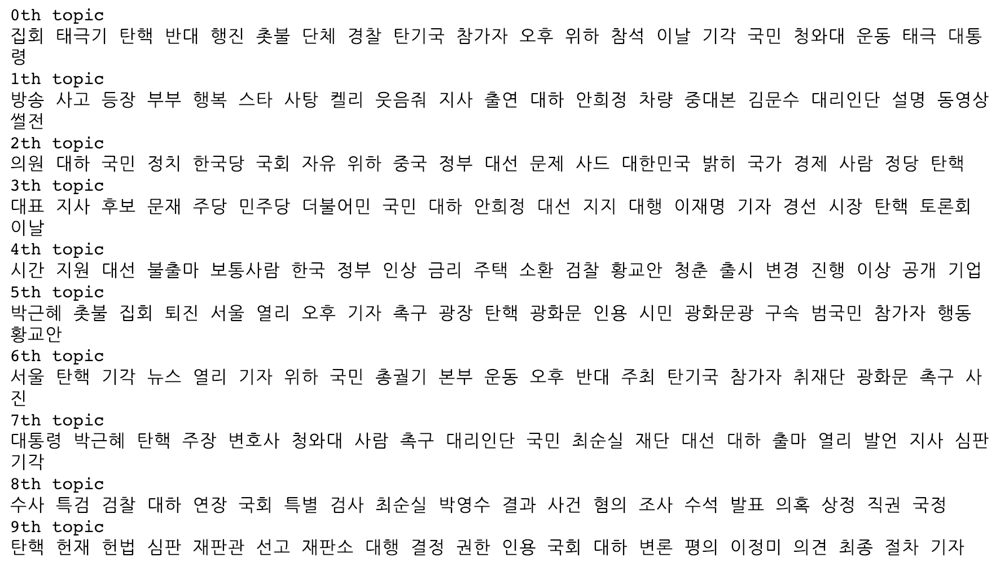
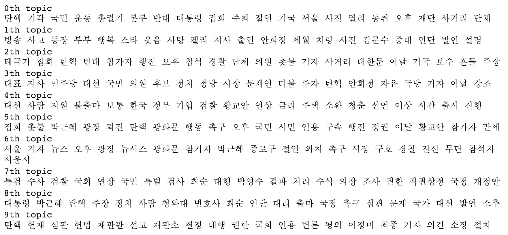
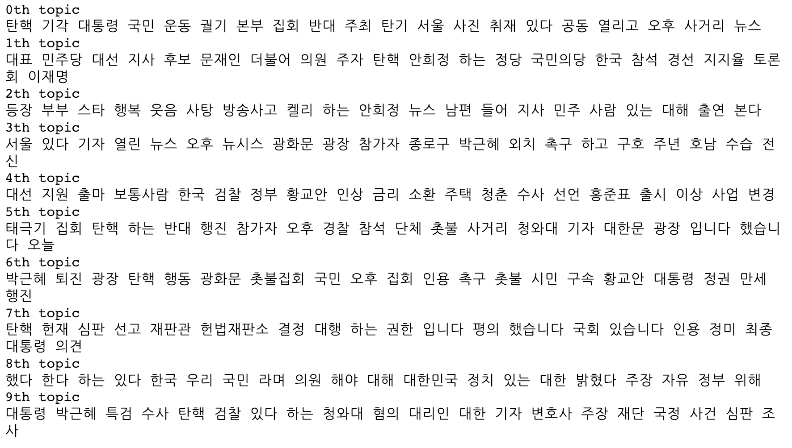

# Topic modeling using Khaiii

## Description
* 이 코드는 카카오톡에서 공개한 형태소 분석기를 실험해보고 실제 예제에 활용할 수 있도록 토픽모델링에 적용한 코드입니다.

* 데이터는 제가 가지고 있는 뉴스 데이터를 가지고 실험했습니다. (2017년 3월경 기사들)

## Topic modeling
토픽모델링의 경우 Scikit-learn에 있는 NMF (Nonnegative Matrix Factorization)을 사용했습니다.

## Results
*  각 전처리기의 토픽모델링 결과이며, 괄호 안 시간은 전처리 시간입니다. (1만개 뉴스 기사 기준)

1. Topics with Khaiii (4m 45s)

2. Topics with Mecab (25s)

3. Topics with Okt without stemming (Twitter) (10m 2s)

4. Topics with Okt with stemming (Twitter) (11m)

### Contact
틀린 부분이 있거나 궁금한 점이 있으시다면 rudvlf0413@korea.ac.kr 으로 문의주시기 바랍니다.
